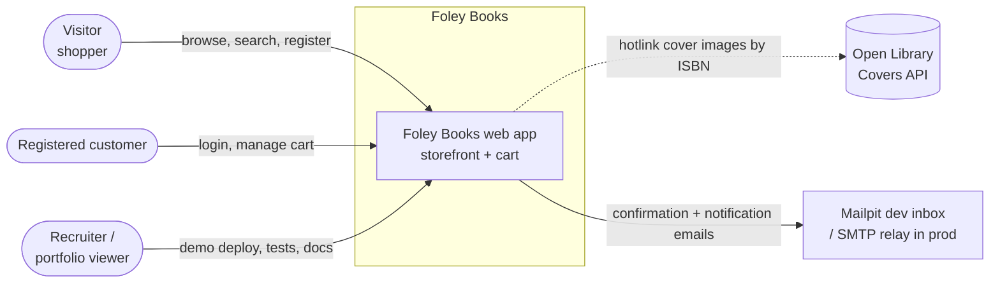
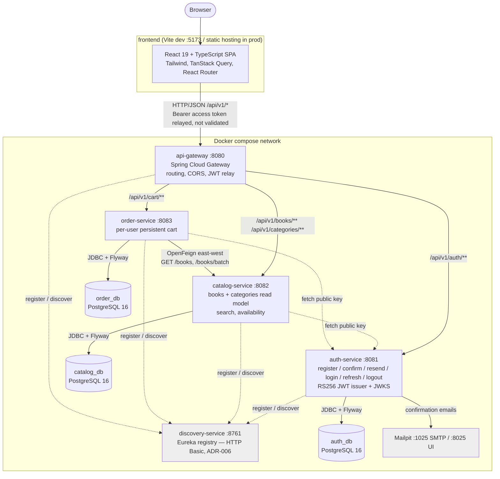
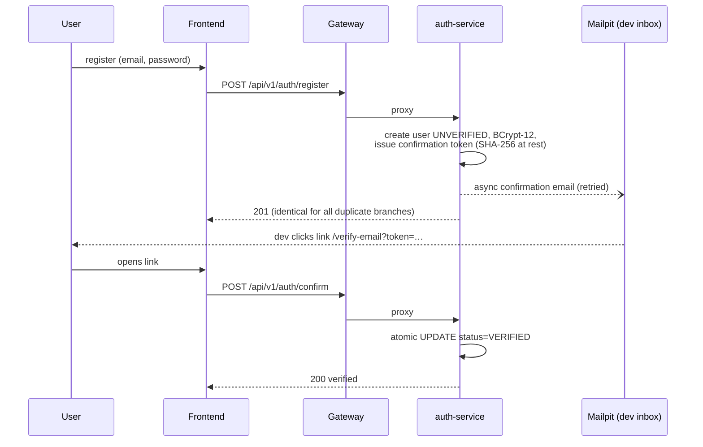
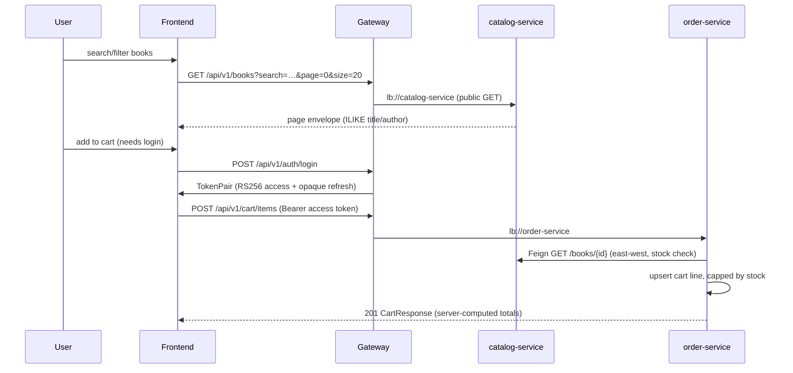

# Architecture — Foley Books

Skeleton delivered with P-07; keep in sync whenever a module, route, or integration
changes (diagrams updated alongside ADRs). Stack facts follow the repository's
engineering conventions; decisions are tracked in [`adr/`](adr/).

## 1. System context (C4 level 1)

Who uses the system and what it touches from the outside world.

- The only internet-facing component is the API gateway (C27); in local dev even
  that is host-only (`localhost:8080`).
- No payment provider in the MVP — checkout is explicitly out of scope (Spec 001).

## 2. Container view (C4 level 2)

Modules, ports, protocols, and the database-per-service boundary.

### Container responsibilities and contracts

| Container          | Exposes                              | Consumes                          | Owns data          |
| ------------------ | ------------------------------------ | --------------------------------- | ------------------ |
| `frontend`         | —                                    | gateway `/api/v1/**` (REST/JSON)  | none (cart in DB)  |
| `api-gateway`      | `:8080` (only public HTTP port)      | Eureka (routes), JWT relay        | none               |
| `discovery-service`| Eureka API/dashboard (Basic auth)    | —                                 | registry (memory)  |
| `auth-service`     | `/api/v1/auth/**`, `/oauth2/jwks`    | SMTP (Mailpit dev), Eureka        | `auth_db`          |
| `catalog-service`  | `/api/v1/books/**`, `/api/v1/categories/**` | Eureka, JWKS (auth)        | `catalog_db`       |
| `order-service`    | `/api/v1/cart/**`                    | catalog via OpenFeign, JWKS, Eureka | `order_db`       |

### Key constraints reflected above

- **Database-per-service**: no shared schemas, no cross-service FKs; cart stores
  `book_id` values only and enriches via Feign (C18, ADR-005).
- **Stateless services**: session state lives in JWTs / the DB — no `HttpSession`.
- **Security**: JWT RS256 issued by auth-service; every other service validates via
  `spring.security.oauth2.resourceserver.jwt` against the JWKS URI
  (`JWKS_URI` env). CORS only at the gateway. Deny-by-default elsewhere (C22, D-14).
- **Gateway-only east-west policy**: the frontend never talks to a domain service
  directly; inter-service calls (order → catalog) bypass the gateway via Eureka.

## 3. Component view (C4 level 3)

Per-service internals follow the package-by-feature layout mandated by this
repository (`api → service → repository`, entities never crossing the HTTP
boundary). Detailed component diagrams will be added per service in their specs
(auth, catalog, order) — this section is intentionally the layout, not invented
detail.

## 4. Cross-cutting flows

### Email confirmation (MVP, Spec 001)

### Browse + cart (MVP, Spec 001)

## 5. Where to read next

- [`docs/adr/`](adr/) — decision records (mail sending: ADR-001; auth schema:
  ADR-002; Eureka security: ADR-006; public auth allowlist + security errors:
  ADR-007; more land with each spec phase)
- Module structure, endpoint map and technical decisions (D-01..D-15) are defined in
  the Spec 001 plan; product requirements live in the spec — both are maintained
  outside the public repository.
